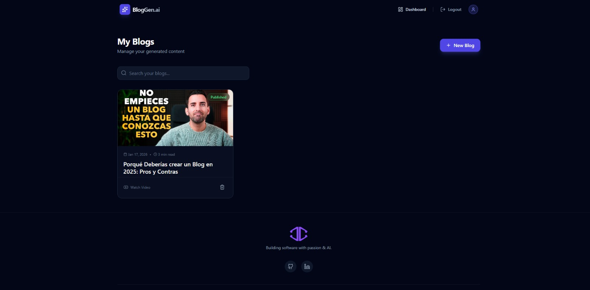
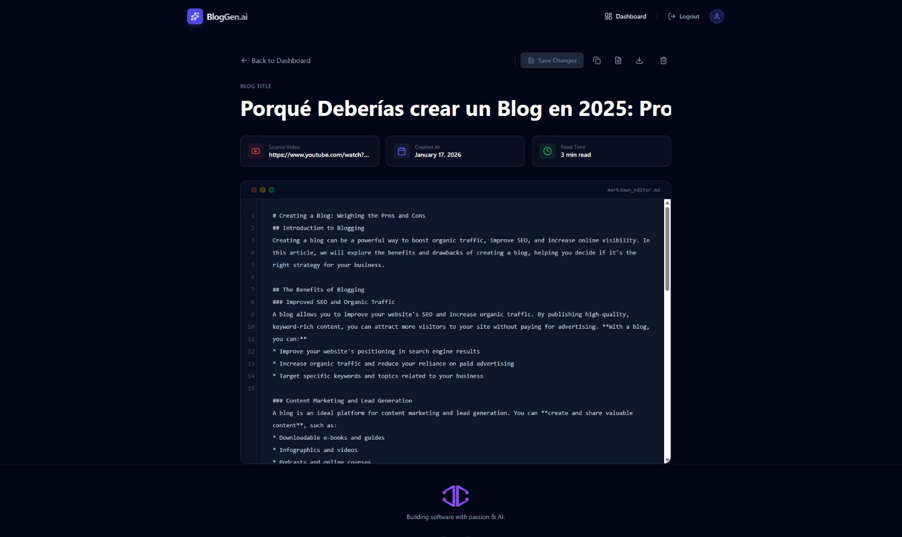
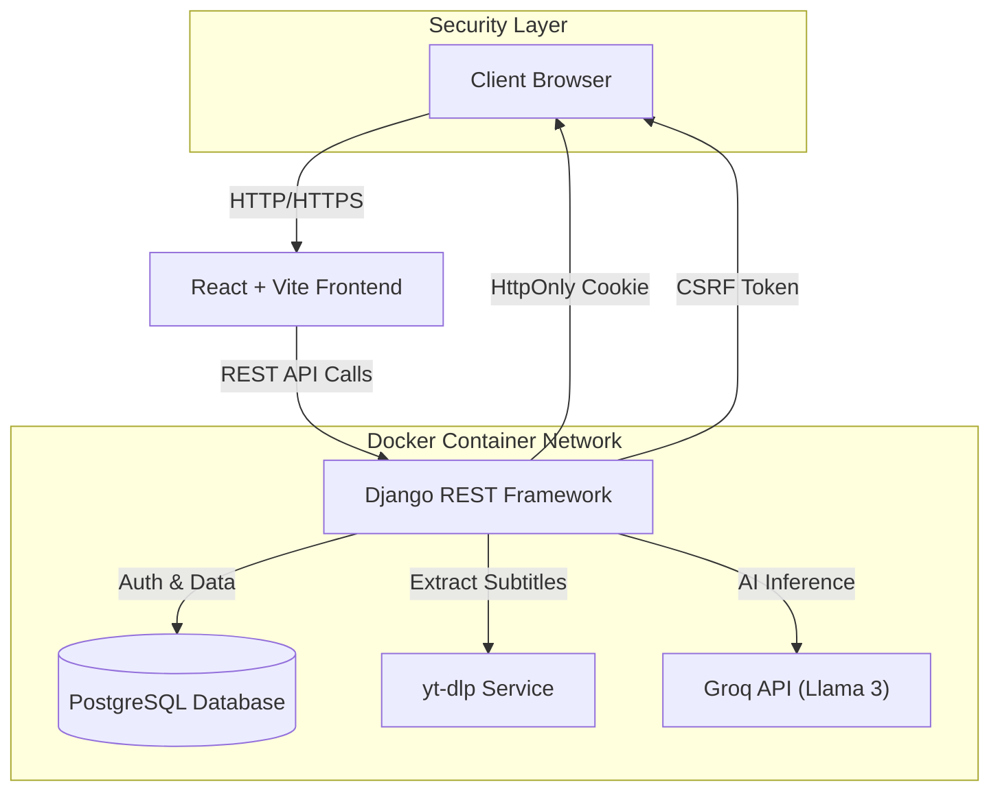

<div align="center">

# 🚀 AI Blog Generator

### Transform YouTube Videos into SEO-Optimized Blog Posts with AI

[](https://www.typescriptlang.org/)
[](https://reactjs.org/)
[](https://www.djangoproject.com/)
[](https://www.postgresql.org/)
[](https://www.docker.com/)
[](https://groq.com/)

</div>

---
**High-performance SaaS that transforms video content into SEO-optimized articles using Llama 3 & Groq LPU.**

---

## 📋 Overview

**BlogGen-ai** is a production-ready, AI-native SaaS application designed to solve the content repurposing bottleneck.  
It leverages the **Groq LPU (Language Processing Unit)** to perform near-instantaneous inference, converting raw YouTube video transcripts into structured, publication-ready blog posts.

Unlike simple wrappers, this project implements a full **Clean Architecture**, robust security patterns, and a custom Markdown rendering engine, demonstrating true end-to-end product engineering.

---

## 📸 Screenshots

### 🏠 Landing Page


### ⚙️ Application Interface

|             **User Dashboard**             |       **Markdown Editor**        |
| :----------------------------------------: | :------------------------------: |
|  |  |

---


## 💡 The Solution

A seamless pipeline that:

1. **Extracts & Sanitizes**  
   Pulls subtitles using `yt-dlp` and cleans timestamps and metadata.

2. **Comprehends**  
   Uses **Llama 3 (70B)** to analyze context, tone, and key takeaways.

3. **Generates**  
   Produces SEO-optimized Markdown with proper hierarchy (H1–H3), not generic text blobs.

4. **Manages**  
   Provides a full CMS experience with real-time editing and multi-format export.

---

## 🏗️ Architecture

The system follows a decoupled, containerized architecture ensuring consistency from development to production.



---

## 🧠 AI Engineering Strategy

This project goes beyond basic API calls by applying AI-native engineering patterns:

- **Groq LPU Integration**  
  Selected over standard GPU providers to reduce inference latency from ~10s to **<1.5s**, enabling a real-time UX.

- **Context-Aware Prompting**  
  System prompts enforce strict Markdown structure and SEO rules, preventing hallucinated layouts.

- **Token Optimization**  
  Transcript pre-processing removes filler and non-lexical sounds, maximizing effective context window usage.

---

## ✨ Key Features

### 🤖 Core AI Capabilities
- Multi-language support with automatic language detection
- Structured output: Title, Meta Description, Intro, Body (H2/H3), Conclusion
- Smart formatting using bold text and lists for readability

### 🔐 Security & Production Standards
- Stateless JWT authentication with **HttpOnly cookies** (no LocalStorage XSS risk)
- CSRF protection via Django middleware
- Dockerized services with one-command deployment

### 📝 CMS Interface
- Real-time Markdown editor with live preview
- Full CRUD operations for content
- Export engine: `.md` or raw HTML

---

## 🛠️ Tech Stack

### Frontend
- React 19 + TypeScript (Strict Mode)
- Vite
- Tailwind CSS + Lucide Icons
- React Hooks + Context API

### Backend
- Python 3.11
- Django 5.0
- Django REST Framework
- PostgreSQL 15 (Alpine)

### AI & Infrastructure
- Groq SDK (Llama 3.3 70B)
- Docker & Docker Compose

---

## 🔌 API Endpoints

| Service | Method | Endpoint | Description |
|-------|------|--------|------------|
| Auth | POST | /api/login | Returns HttpOnly access/refresh tokens |
| Auth | POST | /api/token/refresh | Silent token rotation |
| AI Core | POST | /api/generate-blog | Triggers transcript extraction + inference |
| CMS | GET | /api/blog-posts | List paginated user content |
| CMS | PUT | /api/blog-posts/{id}/ | Update content (real-time save) |

---

## 🚀 Installation

### Prerequisites
- Docker
- Docker Compose
- Groq API Key (Free Beta)

### Quick Start

```bash
git clone https://github.com/JACS002/BlogGen-ai
cd BlogGen-ai
cp .env.example .env
```

Set environment variables:

```env
GROQ_API_KEY=gsk_your_key_here
DB_PASSWORD=postgres
SECRET_KEY=unsafe-secret-key
```

Deploy the stack:

```bash
docker-compose up --build -d
```

- Frontend: http://localhost:5173  
- Backend: http://localhost:8000  

---

## 👨‍💻 Engineering Decisions & Trade-offs

- **Why Groq?**  
  Latency is critical for UX. Groq LPUs provide industry-leading Time-To-First-Token (TTFT).

- **Why Django?**  
  Python offers superior maintainability and tooling for AI pipelines and video processing.

- **Why PostgreSQL?**  
  Enforces strong relational integrity between Users and Generated Content.

---
## 🎯 Key Technical Highlights

### Full-Stack Proficiency

- **Frontend**: Modern React with TypeScript, demonstrating type-safe component architecture
- **Backend**: RESTful API design with Django, following industry best practices
- **Database**: Relational database (PostgreSQL) design with proper indexing and query optimization
- **DevOps**: Containerization strategy for consistent environments across dev/staging/prod

### Security Awareness

- Implemented HttpOnly cookies to prevent XSS attacks
- CSRF token validation for state-changing operations
- Password hashing with PBKDF2 algorithm
- JWT token authentication with expiration handling
- Environment variable management for sensitive data
- CORS configuration for controlled API access

### AI/ML Integration

- Successfully integrated third-party AI API (Groq)
- Custom prompt engineering for consistent AI output
- Error handling for external API failures
- Rate limiting considerations for API usage
- Cost optimization through efficient transcript processing

### Clean Code Practices

- TypeScript for compile-time type safety
- Component composition and reusability
- Separation of concerns (services, components, pages)
- RESTful API design principles
- Django ORM for database abstraction
- Comprehensive error handling and user feedback

### Performance Optimization

- Vite for fast development builds
- React 19's automatic optimizations
- Database query optimization with select_related
- Lazy loading for routes
- Image optimization strategies

---


## 📝 License

This project is licensed under the MIT License - see the [LICENSE](LICENSE) file for details.

---

## 👨‍💻 Author

**Joel Cuascota - JACS**

- Portfolio: [jacs.dev](https:/www.jacs.dev)
- LinkedIn: [linkedin.com/in/joel-cuascota](https://linkedin.com/in/joel-cuascota)
- GitHub: [@JACS002](https://github.com/JACS002)
- Email: joel.cuascota@hotmail.com

---

<div align="center">

### ⭐ Star this repository if you find it helpful!

**Made with ❤️ and ☕**

</div>
